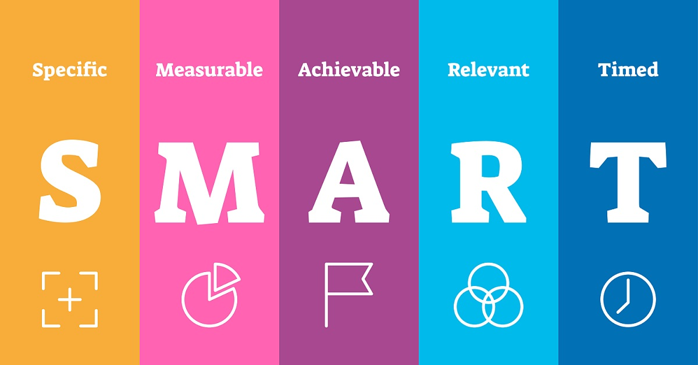

### Ziele (SMART)

Unser Ziel ist es ein Frontend zu erstellen und eine Open API zu verwenden. Wir wollen stündlich neue Artikel gepostet werden oder aktualisiert werden. Dank der letzten üK haben wir nun ein Grundwissen über die API und wie man ein Frontend erstellt. Wir haben uns vorgenommen, am Freitag das Projekt fertig zu stellen.

